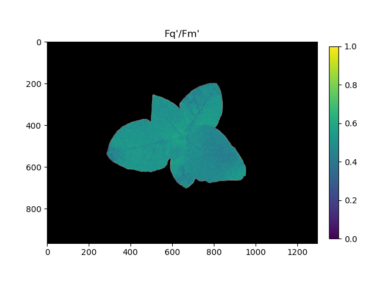

## Analyze the efficiency of Photosystem II

Extract estimates of the efficiency (YII) of Photosystem II (PSII).
The photosynthesis subpackage is dependent on a PSII_Data instance file structure as created by photosynthesis.read_* files.

**plantcv.analyze.yii**(*ps_da, labeled_mask, n_labels=1, auto_fm=False, measurement_labels=None, label="default"*)

**returns** YII DataArray, YII histograms

- **Parameters:**
    - ps_da - Photosynthesis xarray DataArray (either ojip_dark or ojip_light). Can either have a pair of frames F0,Fm or pair(s) of Fp,Fmp.
    - labeled_mask - Labeled mask of objects (32-bit).
    - n_labels - Total number expected individual objects (default = 1).
    - auto_fm - Automatically calculate the frame with maximum fluorescence per label, otherwise use a fixed frame for all labels (default = False).
    - measurement_labels - list of label(s) for each measurement, modifies the default variable names of observations. must have same length as number of measurements in ps_da
    - label - Optional label parameter, modifies the entity name of observations recorded. (default `label="default"`)
- **Context:**
    - Used to extract Fv/Fm, Fv'/Fm' or Fq'/Fm' per identified plant pixel.
    - Generates histograms of Fv/Fm, Fv'/Fm' or Fq'/Fm' data.
    - Generates an Fv/Fm, Fv'/Fm' or Fq'/Fm' DataArray.
- **Example use:**
    - [Use In PSII Tutorial](tutorials/psII_tutorial.md)
- **Output data stored:** Data ('yii_hist_{measurement_label}', 'yii_max_{measurement_label}', 'yii_median_{measurement_label}' automatically gets stored to the 
  [`Outputs` class](outputs.md) when this function is run. These data can always get accessed during a workflow 
  (example below). [Summary of Output Observations](output_measurements.md#summary-of-output-observations)

**Fluorescence images**


From top-left to bottom-right: Dark-adapted (F-dark, F0, Fm) and Light-adapted (F-light', F', and Fm')

**Analyze Fv/Fm**

```python
from plantcv import plantcv as pcv

# Set global debug behavior to None (default), "print" (to file), 
# or "plot" (Jupyter Notebooks or X11)
pcv.params.debug = "plot"

# photosynthesis read functions will read fluroescence data into predefined data format that includes at least attribute 'ojip_dark'
ps = pcv.photosynthesis.read_cropreporter(filename="mydata.inf")

# Analyze Fv/Fm    
fvfm, fvfm_hist = pcv.analyze.yii(ps_da=ps.ojip_dark, labeled_mask=kept_mask, label="plant")

# Access Fv/Fm median value
fvfm_median = pcv.outputs.observations['plant1']['yii_median_t0']['value']

# Pseudocolor the Fv/Fm image
fvfm_cmap = pcv.visualize.pseudocolor(gray_img=fvfm, mask=kept_mask, min_value=0, max_value=1, title="Fv/Fm")

# or you can use xarray builtin plot methods (output not shown):
fvfm.plot()
```

**Histogram of Fv/Fm values**


**Pseudocolored output image based on Fv/Fm**


**Analyze Fq'/Fm' (lightadapted mesaurements)**

```python
from plantcv import plantcv as pcv

# Set global debug behavior to None (default), "print" (to file), 
# or "plot" (Jupyter Notebooks or X11)
pcv.params.debug = "plot"

# Analyze Fq'/Fm'    
fqfm, fqfm_hist = pcv.analyze.yii(ps=ps.ojip_light, labeled_mask=kept_mask, label="plant")

# Access Fq'/Fm' median value
fqfm_median = pcv.outputs.observations['plant1']["yii_median_t1"]['value']

fqfm_cmap = pcv.visualize.pseudocolor(gray_img=fqfm, mask=kept_mask, min_value=0, max_value=1, title="Fq'/Fm'")

# or xarray plot method (output not shown)
fqfm.plot(row = 'measurement', col_wrap = 3)
# or
fqfm.plot(col_wrap='measurement')
```

**Histogram of Fq'/Fm' values**


**Pseudocolored output image based on Fq'/Fm'**



The grayscale YII images can be used with the [pcv.visualize.pseudocolor](visualize_pseudocolor.md) function 
which allows the user to pick a colormap for plotting.

**Source Code:** [Here](https://github.com/danforthcenter/plantcv/blob/master/plantcv/plantcv/analyze/yii.py)
