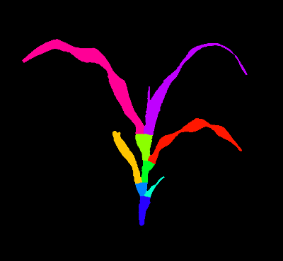

## Fill Segments

Propagate the labels of a segmented skeleton to fill the mask.

**plantcv.morphology.fill_segments**(*mask, objects, stem_objects=None*)

**returns** filled_img  

- **Parameters:**
    - mask - Binary mask
    - objects - Segment objects (output from either [plantcv.morphology.prune](prune.md),
    [plantcv.morphology.segment_skeleton](segment_skeleton.md), or
    [plantcv.morphology.segment_sort](segment_sort.md)).
    - stem_objects - Optional input for stem objects that will be combined into a single object before filling the mask. 
- **Context:**
    - Uses the watershed algorithm to fill the mask propagating the objects' labels.
- **Output data stored:** Data ('segment_area') automatically gets stored to the [`Outputs` class](outputs.md) when this function is ran.
    These data can always get accessed during a workflow (example below). For more detail about data output see [Summary of Output Observations](output_measurements.md#summary-of-output-observations)

**Reference Image:** mask, objects drawn as labels


```python

from plantcv import plantcv as pcv

# Set global debug behavior to None (default), "print" (to file),
# or "plot" (Jupyter Notebooks or X11)
pcv.params.debug = "print"

filled_img = pcv.morphology.fill_segments(mask=plant_mask, objects=obj)

# Access data stored out from fill_segments
segments_area = pcv.outputs.observations['segment_area']['value']

```

*Filled Image*



**Source Code:** [Here](https://github.com/danforthcenter/plantcv/blob/master/plantcv/plantcv/morphology/fill_segments.py)
