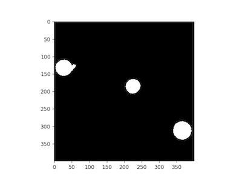
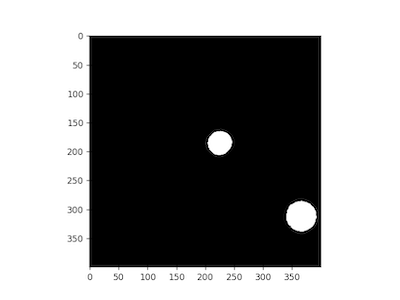

## Flood Fill 

Fills based on a starting point with a user specified value

**plantcv.floodfill**(*bin_img, point, value=0*)

**returns** filled_image

- **Parameters:**
    - bin_img - Binary image data or Gray image
    - point - seed point to start flood fill (e.g. `point=(y,x)`) 
    - value - value from 0-255 
  - **Context:**
    - Used to fill in object 
- **Example use:**
    - Below

```python

from plantcv import plantcv as pcv

# Set global debug behavior to None (default), "print" (to file), 
# or "plot" (Jupyter Notebooks or X11)
pcv.params.debug = "plot"

# Apply flood filll  to a binary image 

fill_image = pcv.floodfill(bin_img=binary_img, point =(137,31), value=0)

```

**Binary image**



**Binary image with holes filled**



**Source Code:** [Here](https://github.com/danforthcenter/plantcv/blob/main/plantcv/plantcv/floodfill.py)
