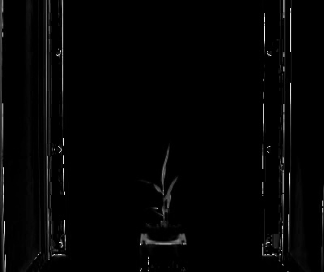
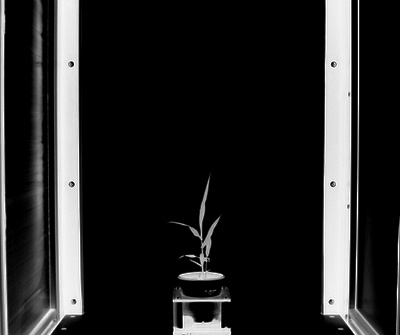

## RGB to CMYK

Convert image from RGB color space to CMYK color space and split the channels.

**plantcv.rgb2gray_cmyk**(*rgb_img, channel*)

**returns** split image (c, m, y or k channel)

- **Parameters:**
    - rgb_img - RGB image data
    - channel - Split 'c' (cyan), 'm' (magenta), 'y' (yellow) or 'k' (black) channel
   
- **Context:**
    - Used to help differentiate plant and background


**Original RGB image**


```python

from plantcv import plantcv as pcv

# Set global debug behavior to None (default), "print" (to file), 
# or "plot" (Jupyter Notebooks or X11)
pcv.params.debug = "print"

# image converted from RGB to CMYK, channels are then split. 
y_channel = pcv.rgb2gray_cmyk(rgb_img=rgb_img, channel='Y')

```

**Cyan channel image**



```python

# Cyan ('c') channel is output
c_channel = pcv.rgb2gray_cmyk(rgb_img=rgb_img, channel='C')

```

**Magenta channel image**


```python

# Magenta ('m') channel is output
m_channel = pcv.rgb2gray_cmyk(rgb_img=rgb_img, channel='M')

```

**Yellow channel image**


```python

# Yellow ('a') channel is output
y_channel = pcv.rgb2gray_cmyk(rgb_img=rgb_img, channel='Y')

```

**Black channel image**



```python

# Black ('k') channel is output
k_channel = pcv.rgb2gray_cmyk(rgb_img=rgb_img, channel='K')

```

**Source Code:** [Here](https://github.com/danforthcenter/plantcv/blob/master/plantcv/plantcv/rgb2gray_cmyk.py)
