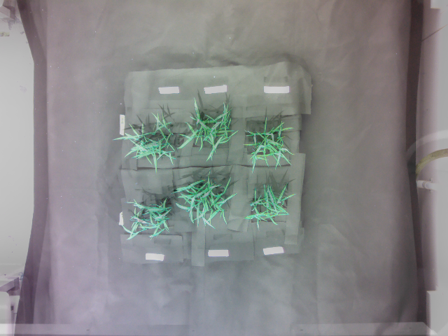

## Image Registration

`ImageRegistrator` is a class that registrater a target image based on user selected landmark pixels on reference and target images. 

*class* **plantcv.transform.ImageRegistrator(img_ref, img_tar, figsize=(12, 6))**

To initialize an instance of `ImageRegistrator` class, two required parameters are `img_ref` and `img_tar`, represent for target image and reference image, respectively.

Another optional parameter is the desired figure size `figsize`, by default `figsize=(12,6)`.

### Attributes
**img_ref** (`ndarray`, datatype: uint8, required): input reference image.
**img_tar** (`ndarray`, datatype: uint8, required): input target image.
**points** (`list`): list of coordinates of selected pixels on reference image and target image


```python

from plantcv import plantcv as pcv

img_registrator = ImageRegistrator(img_ref, img_tar, figsize=(12, 6))
## collecting land mark points
img_registrator.regist()

```

Reference image (a thermal image):


Target image (a RGB image):


Overlay these two images:



Overlay two images after image registration:


Check out this video for how this interactive tool works!
<iframe src="https://player.vimeo.com/video/522809945" width="640" height="360" frameborder="0" allow="autoplay; fullscreen; picture-in-picture" allowfullscreen></iframe>


**Source Code:** [Here](https://github.com/danforthcenter/plantcv/blob/master/plantcv/plantcv/transform/img_registration.py)
