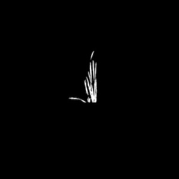
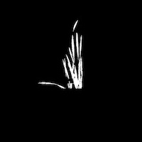

## Resize

Resizes images, used to resize masks over other images.

**plantcv.resize**(*img, size, interpolation=True, \*\*kw*)
**returns** image after resizing
- **Parameters:**
    - img - RGB or grayscale image to resize
    - size - desired new size of the image
    - interpolation: a flog indicating whether or not using interpolation. If set interpolation=True, then the resizing would be based on using known data to estimate values at unknown points. If the interpolation is set to be False, then crop or zero-padding is used to resize the image. By default interpolation is True.
    - **kw: (optional) acceptable keywords are: interp_mtd. If a preferred interpolation method is specified here, the interpolation method will be adopted. If no method is specified, the interpolation method will be decided based on whether doing an enlarging or reducing by default. 
        acceptable values for interp_mtd is consistent with opencv resize function optional parameter "interpolation": "inter_nearest", "inter_linear", "inter_area", "inter_cubic", "inter_lanczos4"
- **Context:**
    - Resizes images to a desired exact size.
- **Example use:**
    - Below
    
**plantcv.resize_factor**(*img, factor_x, factor_y, \*\*kw*)
**returns** image after resizing
- **Parameters:**
    - img - RGB or grayscale image to resize
    - factor_x - resize factor in the x dimension, which resizes the width of the image (does not need to be an integer)
    - factor_y - resize factor in the y dimension, which resizes the height of the image (does not need to be an integer)
    - **kw: (optional) same as the case in the resize function. 
- **Context:**
    - Resizes images based on resizing factors along x and y axes. If the same resizing factor is adopted for both x and y axis, the resizing would preserve the axpect ratio of the original image.
- **Example use:**
    - Below
    
**Input image**

Size of input image 400x335 (width x height)


```python

from plantcv import plantcv as pcv

# Set global debug behavior to None (default), "print" (to file), 
# or "plot" (Jupyter Notebooks or X11)
pcv.params.debug = "plot"
# Resize image using resize function, with interpolation, and default interpolation method
resize_img1 = pcv.resize(img=img, size=(300,300), interpolation=True)

# The interpolation method can be specified
resize_img2 = pcv.resize(img=img, size=(300,300), interpolation=True, interp_mtd="inter_nearest")

# Resize image using resize function, by cropping
resize_img3 = pcv.resize(img=img, size=(200,200), interpolation=False)

# Resize image using resize function, by zero-padding
resize_img4 = pcv.resize(img=img, size=(500,500), interpolation=False)

# Resize image using the resize_factor function
# Note, in this example, the resizing factor for x and y are the same, so the aspect ratio of the original image is preserved 
resize_img5 = pcv.resize_factor(img=img, factor_x=0.1154905775, factor_y=0.1154905775)

```

**Images after resizing**
1st resized image


2nd resized image


3rd resized image (cropping)


3rd resized image (zero-padding)


5th resize image


**Source Code:** [Here](https://github.com/danforthcenter/plantcv/blob/master/plantcv/plantcv/transform/resize.py)
