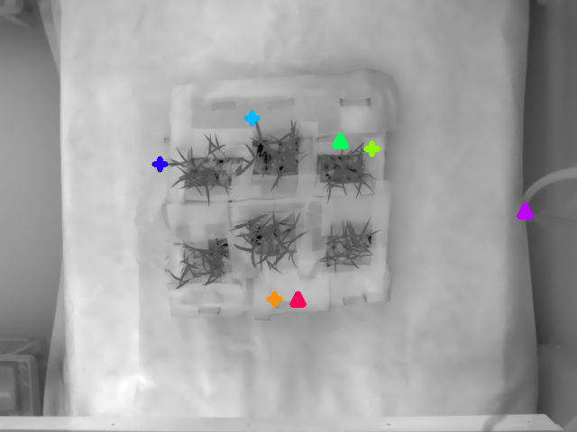

## Warp

Find the transformation matrix that best describes the projective transform from reference image (`refimg`) 
to target image (`img`), based on pairs of corresponding points on the images. The projection aligns `img` to `refimg`.

**In PlantCV we only consider the general case of projective transform.**

In general, any geometric transformation between 4 pairs of corresponding points is considered as projective transform. 
Projective transformation is often useful when images are taken from a slight different point of view or taken with different cameras.  

- Projective Transform: preserves lines but not necessarily parallelism. There are several special cases of projective transform. 
  - Euclidean Transform (rigid transform): preserves the Euclidean distance between pairs of points. 
    It can be described as a rotation about the origin followed by a translation.
    - Similarity Transform: preserves the shape of objects. It combines scaling, translation and rotation. 
  - Affine Transform: preserves lines (hence the alignment of objects), as well as parallelism between lines. 
    It can be decomposed into a similarity transform and a shear transformation.

Read more about different transformations at 
[Image Processing in OpenCV](https://docs.opencv.org/3.4/da/d6e/tutorial_py_geometric_transformations.html) 
and the 
[transform module of scikit-image](https://scikit-image.org/docs/dev/auto_examples/transform/plot_transform_types.html#sphx-glr-auto-examples-transform-plot-transform-types-py). 

**plantcv.transform.warp**(*img, refimg, pts, refpts, method="default"*)

**returns** image after warping and a 3x3 matrix of the perspective transformation.

- **Parameters:**
    - img - (np.ndarray) image to warp 
    - refimg - (np.ndarray) image used as a reference for the warp 
    - pts - (list) coordinate points on `img`. At least 4 pairs should be given as a list of tuples
    - refpts - (list) corresponding coordinate points on `refimg`. At least 4 pairs should be given as a list of tuples
    - method - (str) method used to compute the transformation (homography) matrix.
      Available options are 'default', 'ransac', 'lmeds', 'rho' which correspond to the [opencv methods 
      and vary based on how they handle outlier points](https://docs.opencv.org/3.4/d9/d0c/group__calib3d.html#ga4abc2ece9fab9398f2e560d53c8c9780).
      - 'default': a regular method (the least squares method) using all the points
      - 'ransac': RANSAC-based robust method 
        ([Random sample consensus](https://en.wikipedia.org/wiki/Random_sample_consensus#:~:text=An%20advantage%20of%20RANSAC%20is,present%20in%20the%20data%20set.&text=RANSAC%20can%20only%20estimate%20one%20model%20for%20a%20particular%20data%20set.)) 
      - 'lmeds': Least-Median robust method 
        ([Least Median of Squares](http://www-sop.inria.fr/odyssee/software/old_robotvis/Tutorial-Estim/node25.html))
      - 'RHO': PROSAC-based robust method ([PROSAC](http://cmp.felk.cvut.cz/~matas/papers/chum-prosac-cvpr05.pdf))  
      - Any 4 or more pairs of non-collinear points define a transformation. However, if not all the point pairs fit 
        the projective transformation (which means there are outliers), the initial estimate of transformation matrix 
        will be poor. In this case, one of the three robust estimation methods can be adopted. The methods RANSAC and RHO 
        can handle practically any ratio of outliers. The Least-Median based method works correctly only when there are 
        more than 50% of inliers. Finally, if there are no outliers and the noise is rather small, use the default method.
      - If a robust estimation algorithm is adopted, the outliers will be indicated in the debug image with triangles.
- **Context:**
    - Warps an image without preserving parallel lines. 
- **Example use:**

1. A binary mask derived from an RGB image can be used to segment an NIR image which is difficult to segment otherwise.

**Input image**

A mask derived from a RGB image 2056x2454


An image from a SWIR camera is used as the reference image to define the transformation is 7000x5000


In this case we know the field of view of the two images is the same, so we can use the image corners to define the 
transformation. In other cases you might need to establish corresponding control points in each image.

```python

from plantcv import plantcv as pcv

# Set global debug behavior to None (default), "print" (to file),
# or "plot" (Jupyter Notebooks or X11)
mrow, mcol = mask.shape
vrow, vcol, vdepth = grayimg.shape

img_warped, mat = pcv.transform.warp(img=mask,
                                refimg=grayimg,
                                pts = [(0,0),(mcol-1,0),(mcol-1,mrow-1),(0,mrow-1)],
                                refpts = [(0,0),(vcol-1,0),(vcol-1,vrow-1),(0,vrow-1)],
                                method='default')


```
2. Register the RGB image to the corresponding thermal image based on landmark points so that the mask derived from 
   it can be used to extract plant pixels from the corresponding thermal image.

**Input Image**

A thermal image (reference image) and its corresponding RGB image (target image).


See the poor overlay of the thermal image on the corresponding RGB image before image registration:


We define pairs of corresponding landmark points on both images:


Currently you'll need to do some trial and error to identify matching coordinates but check back later for information of getting landmark coordinates to register two images in a user-friendly interactive way!

```python

from plantcv import plantcv as pcv
pcv.params.marker_size=12
img_warped, mat = pcv.transform.warp(img=im_RGB,
                                refimg=im_therm,
                                pts=pts_RGB,
                                refpts=pts_therm,
                                method = 'ransac')
```

Warped RGB image:


Overlay the thermal image on warped RGB image:


Reference image with markers:


Target image with markers:


A pair of corresponding inlier points are represented with the same color with the "+" marker; 
the outliers are represented using upper triangles. 

## Warp Align
**plantcv.transform.warp_align**(*img, refimg, mat)*

**returns** image after warping.

Highly related to the `warp` function, the `warp_align` function takes an input image, a transformation matrix, 
and perform the geometric transformation defined by the given transformation matrix. 
- **Parameters:**
    - img - (np.ndarray) image to warp
    - refimg - (np.ndarray) image used as a reference for the warp. 
      If provided, the warped image would be overlaid on the reference image to visualize; 
      otherwise, the warped image would be overlaid on the original image.
    - mat - (np.ndarray) a 3x3 matrix that describes the projective transformation. 
      Typically, it would be the 2nd output of the `transform.warp` function.
    

- **Context:**
    - Warps an image based on the transformation matrix. 
    
- **Example use:**
```python

from plantcv import plantcv as pcv
import numpy as np
# M1 is the 2nd output from pcv.transform.warp
img_warped  = pcv.transform.warp_align(img=im_RGB, refimg=im_therm, mat=M1)

# M2 defines a translation transformation, which is a special case of projective transformation
M2 = np.array([[1.0,0.0,100.0],[0.0,1.0,50.0],[0.0,0.0,1.0]])
# A reference image is not available so im_RGB can be used instead
img_warped2 = pcv.transform.warp_align(img=im_RGB,img=im_RGB, mat=M2)

```

Warped image:


Superimposed image of the warped image and the reference image (reference image provided):


Warped image:


Superimposed image of the warped image and the original image (reference image not provided):


**Source Code:** [Here](https://github.com/danforthcenter/plantcv/blob/master/plantcv/plantcv/transform/warp.py)
