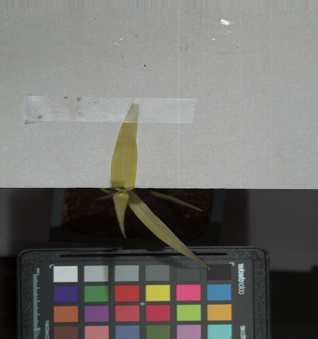
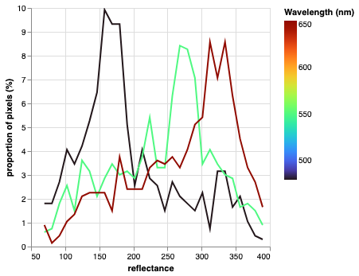
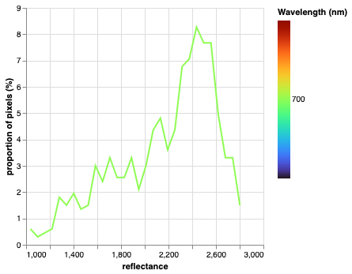
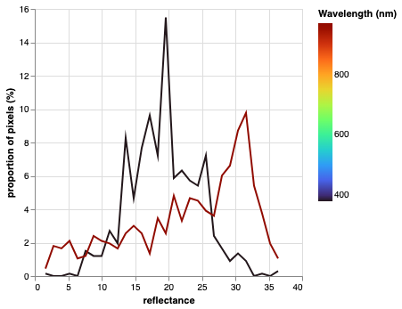
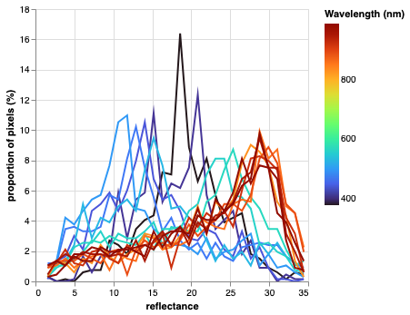

## Plot Histogram for Hyperspectral Images

This is a plotting method that is used to examine the distrubution of signal within an hyperspectral image for specific wavelengths. This function is an application of the [histogram](visualize_histogram.md) function.

**plantcv.visualize.hyper_histogram**(*hsi, mask=None, bins=100, lower_bound=None, upper_bound=None, title=None, wvlengths=[480, 550, 670]*)

**returns** fig_hist

- **Parameters:**
    - hsi - Spectral_data
    - mask - Optional binary mask made from selected contours.
    - bins - Number of class to divide spectrum into (default bins=100).
    - lower_bound - Lower bound of range to be shown in the histogram (default lower_range=None). 
    - upper_bound - Upper bound of range to be shown in the histogram. 
    - title - The title for the histogram (default title=None) 
    - wvlengths - Interested wavelengths (in nanometers) to show histogram of (default wvlengths=[480, 550, 670])
    
- **Context:**
    - Examine the distribution of the signal, this can help select a value for calling the binary thresholding function.
    - If the provided wavelength is in the range of visible spectrum, the color corresponds to the wavelength would be used as the histogram color
    
- **Example use:**
<!---
    - [Use In NIR Tutorial](nir_tutorial.md)
  --->

**Hyperspectral image**



**Mask**


```python

from plantcv import plantcv as pcv

pcv.params.debug = "plot"

# Showing histograms for 3 default wavelengths
hist_figure1 = pcv.visualize.hyper_histogram(hsi, mask=mask)

# Showing the histogram for a single wavelength (700nm)
hist_figure2 = pcv.visualize.hyper_histogram(hsi, mask=mask, wvlengths=[700])

# Showing the histogram for two wavelengths 
hist_figure3 = pcv.visualize.hyper_histogram(hsi, mask=mask, wvlengths=[380, 970])

# Showing the histogram for multiple wavelengths
hist_figure4 = pcv.visualize.hyper_histogram(hsi, mask, 
                                             wvlengths=[379, 409, 439, 469, 499, 529, 559, 568, 
                                                        619, 649, 679, 709, 739, 769, 799, 
                                                        829, 859, 889, 
                                                        919, 949, 979, 1000])

```

**Histogram of signal intensity**









**Source Code:** [Here](https://github.com/danforthcenter/plantcv/blob/master/plantcv/plantcv/visualize/hyper_histogram.py)
